# 100 Days of Machine Learning 🚀

Welcome to my **100 Days of Machine Learning Challenge** repository!  
This repository contains my daily Machine Learning practice, mini projects, notebooks, and output screenshots.

The goal of this challenge is to strengthen my:
- Machine Learning concepts
- Python implementation skills
- Data preprocessing techniques
- Model building & evaluation
- Real-world project experience

---

# 📅 Daily Progress

## Day 1 - 1 May 2026
### 🔹 Jupyter Notebook
[Open Notebook](2026-05-01_ML_001.ipynb)

### 🔹 Output Screenshot
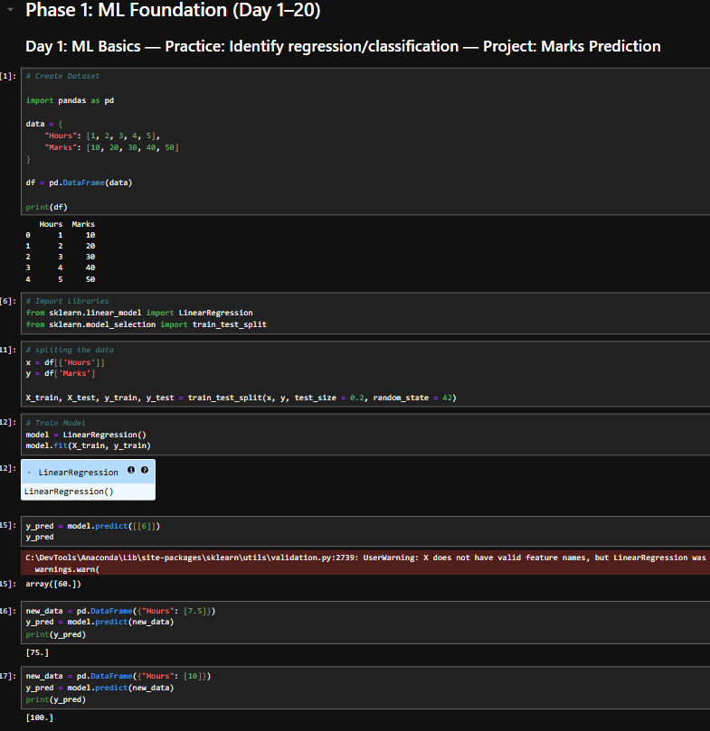

---

## Day 2 - 2 May 2026
### 🔹 Jupyter Notebook
[Open Notebook](2026-05-02_ML_002.ipynb)

### 🔹 Output Screenshot
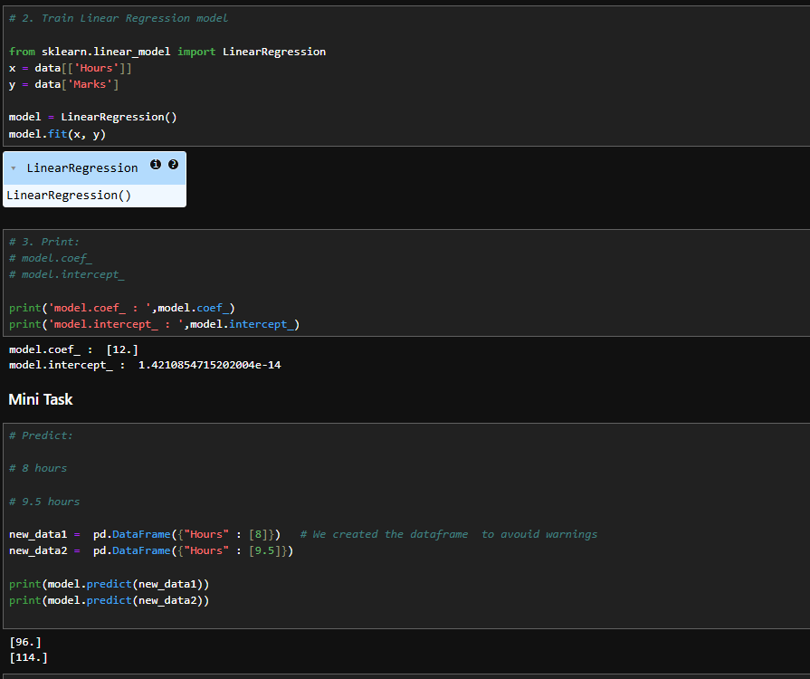

---

## Day 3 - 3 May 2026
### 🔹 Jupyter Notebook
[Open Notebook](2026-05-03_ML_003.ipynb)

### 🔹 Output Screenshot
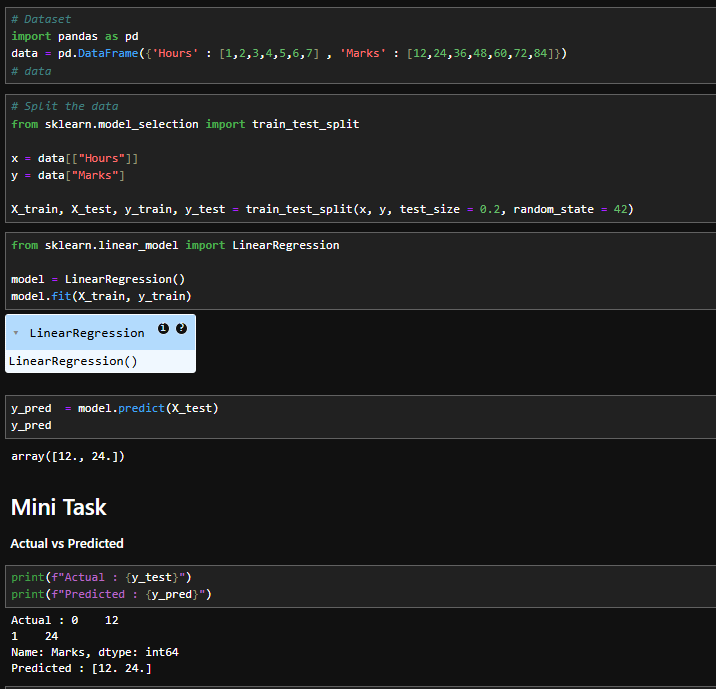

---

## Day 4 - 4 May 2026
### 🔹 Jupyter Notebook
[Open Notebook](2026-05-04_ML_004.ipynb)

### 🔹 Output Screenshot
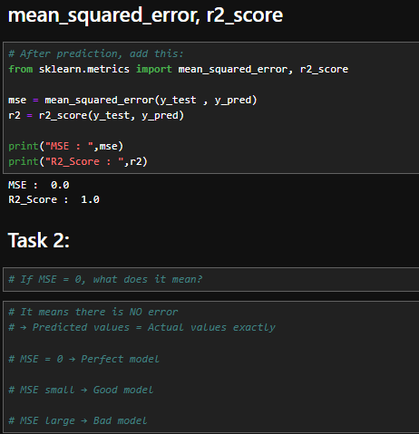

---

## Day 5 - 5 May 2026
### 🔹 Jupyter Notebook
[Open Notebook](2026-05-05_ML_005.ipynb)

### 🔹 Output Screenshot
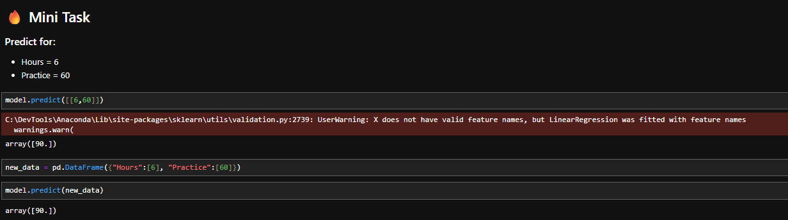

---

## Day 6 - 6 May 2026
### 🔹 Jupyter Notebook
[Open Notebook](2026-05-06_ML_006.ipynb)

### 🔹 Output Screenshot
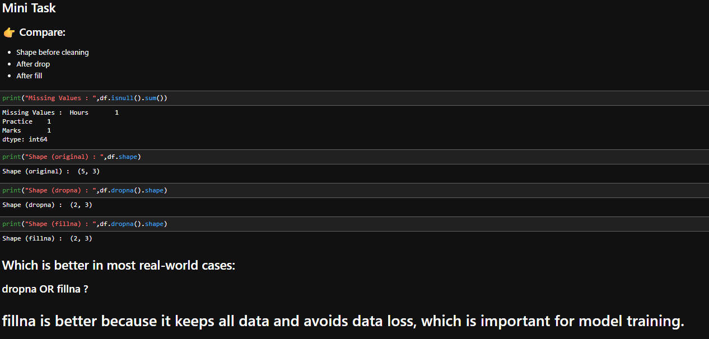

---

## Day 7 - 7 May 2026
### 🔹 Jupyter Notebook
[Open Notebook](2026-05-07_ML_007.ipynb)

### 🔹 Output Screenshot
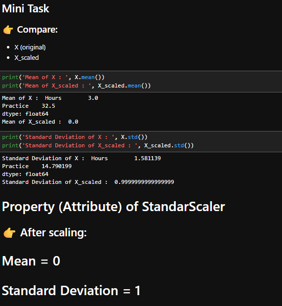

---

## Day 8 - 8 May 2026
### 🔹 Jupyter Notebook
[Open Notebook](2026-05-08_ML_008.ipynb)

### 🔹 Output Screenshot
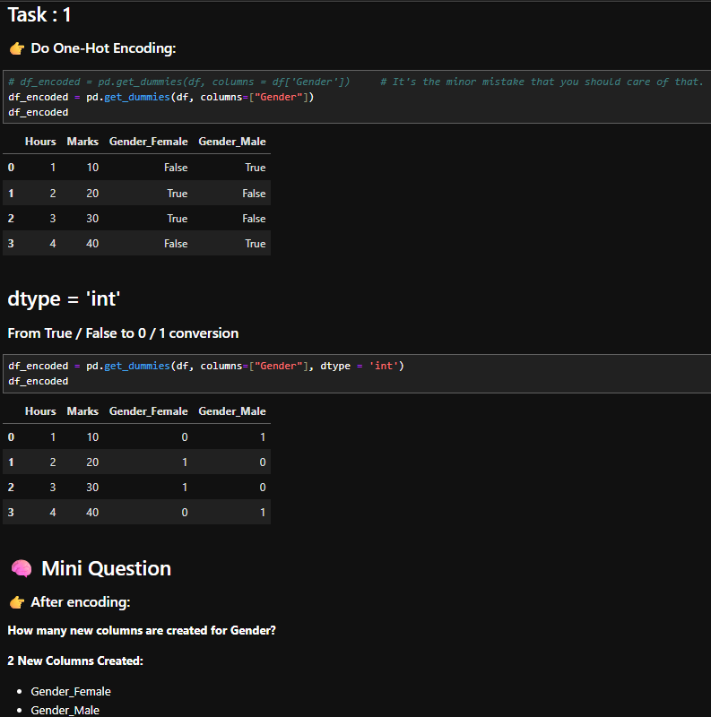

---

## Day 9 - 9 May 2026
### 🔹 Jupyter Notebook
[Open Notebook](2026-05-09_ML_009.ipynb)

### 🔹 Output Screenshot
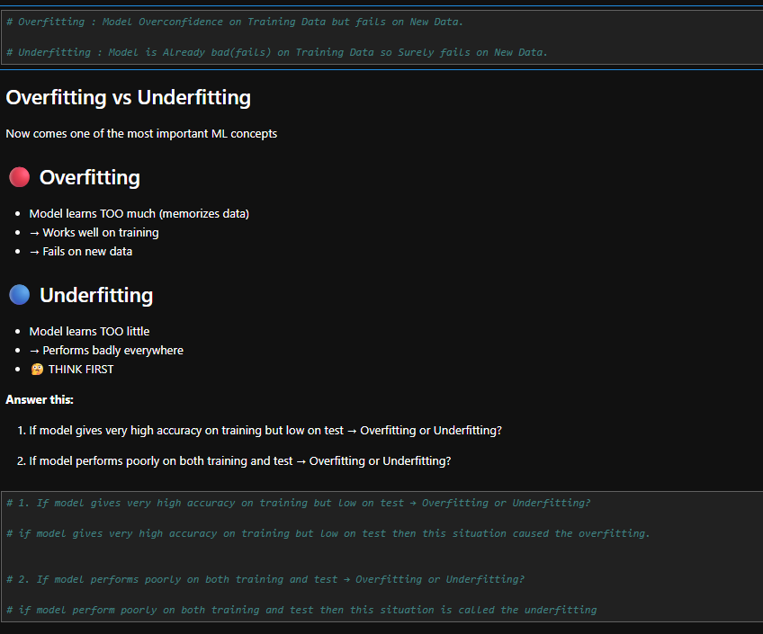

---

## Day 10 - 10 May 2026
### 🔹 Jupyter Notebook
[Open Notebook](2026-05-10_ML_010.ipynb)

### 🔹 Output Screenshot
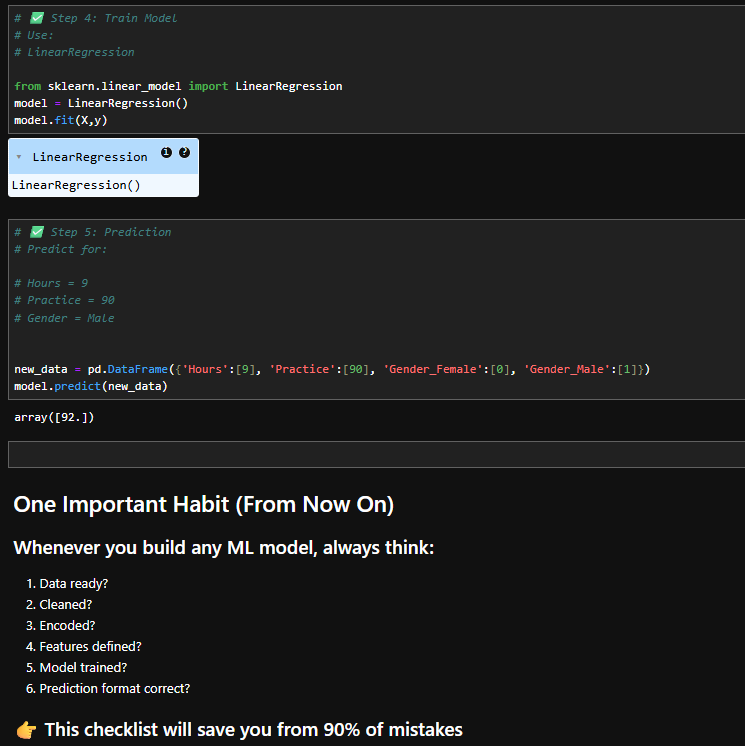

---

## Day 11 - 11 May 2026
### 🔹 Jupyter Notebook
[Open Notebook](2026-05-11_ML_011.ipynb)

### 🔹 Output Screenshot
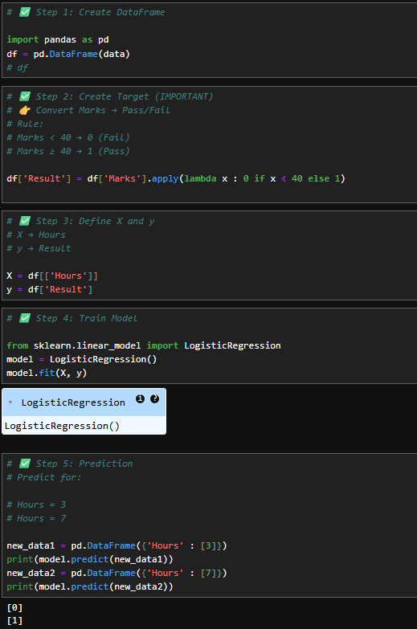

---

## Day 12 - 12 May 2026
### 🔹 Jupyter Notebook
[Open Notebook](2026-05-12_ML_012.ipynb)

### 🔹 Output Screenshot
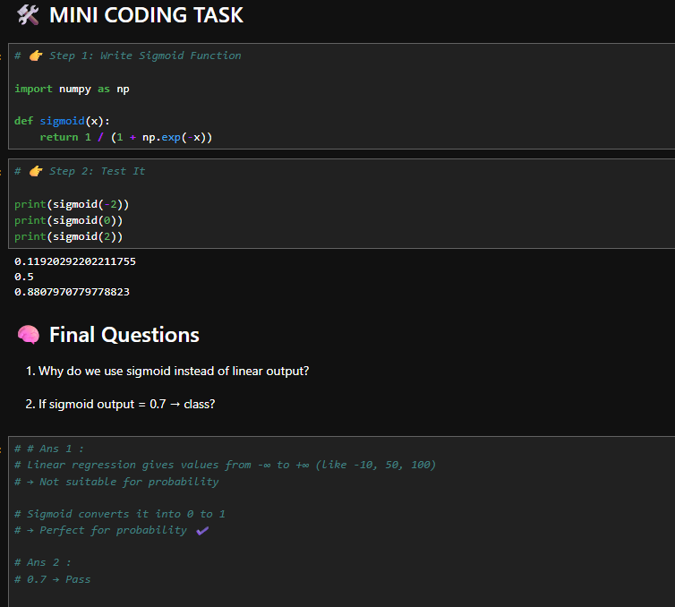

---

## Day 13 - 13 May 2026
### 🔹 Jupyter Notebook
[Open Notebook](2026-05-13_ML_013.ipynb)

### 🔹 Output Screenshot
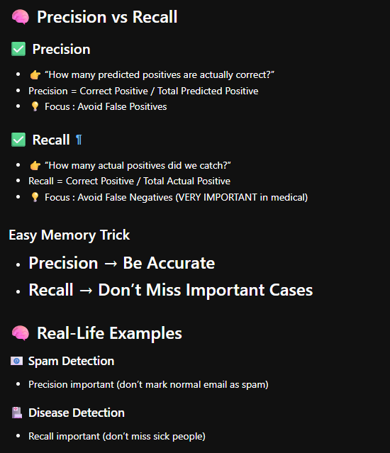

---

## Day 14 - 14 May 2026
### 🔹 Jupyter Notebook
[Open Notebook](2026-05-14_ML_014.ipynb)

### 🔹 Output Screenshot
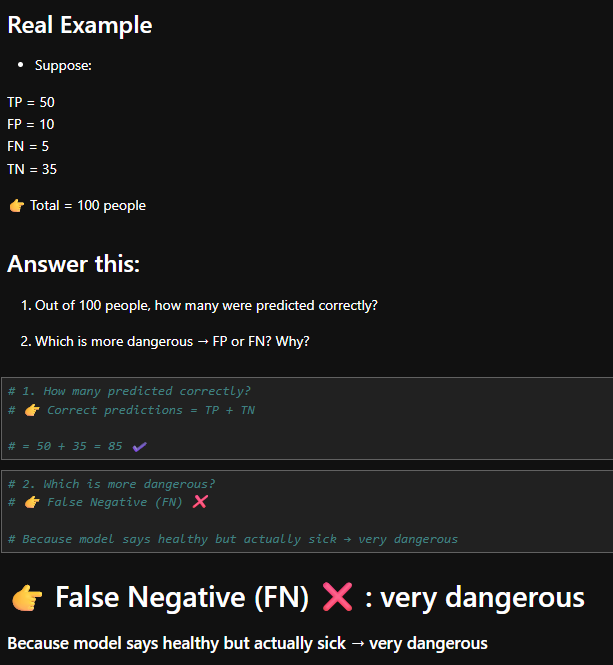

---

## Day 15 - 15 May 2026
### 🔹 Jupyter Notebook
[Open Notebook](2026-05-15_ML_015.ipynb)

### 🔹 Output Screenshot
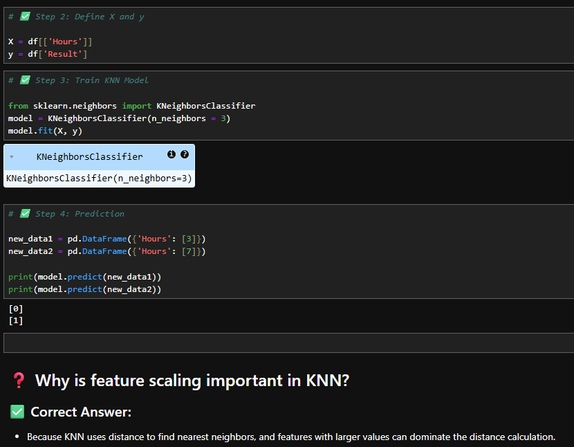

---

## Day 16 - 16 May 2026
### 🔹 Jupyter Notebook
[Open Notebook](2026-05-16_ML_016.ipynb)

### 🔹 Output Screenshot
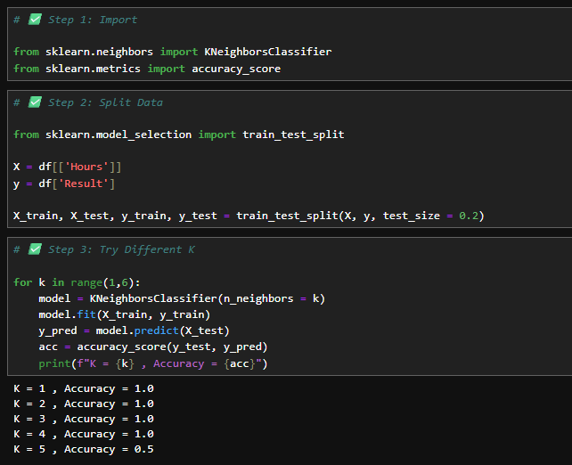

---

## Day 17 - 17 May 2026
### 🔹 Jupyter Notebook
[Open Notebook](2026-05-17_ML_017.ipynb)

### 🔹 Output Screenshot
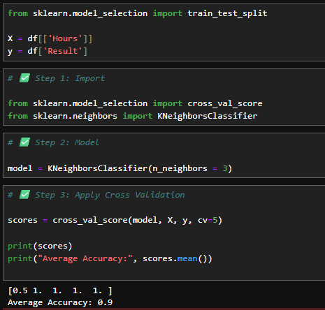

---

## Day 18 - 18 May 2026
### 🔹 Jupyter Notebook
[Open Notebook](2026-05-18_ML_018.ipynb)

### 🔹 Output Screenshot
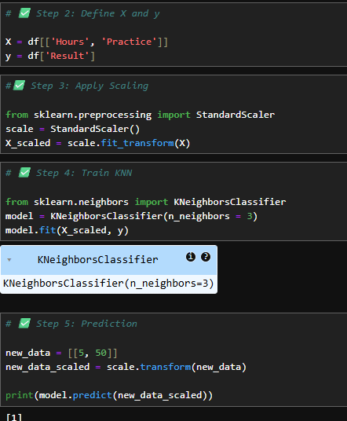

---

## Day 19 - 19 May 2026
### 🔹 Jupyter Notebook
[Open Notebook](2026-05-19_ML_019.ipynb)

### 🔹 Output Screenshot
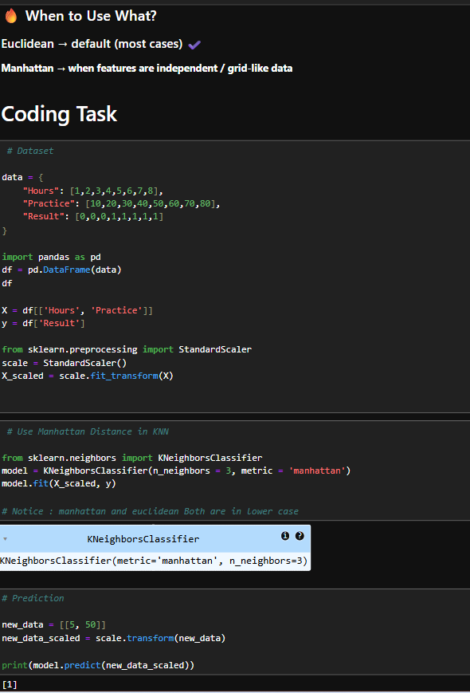

---

## Day 20 - 20 May 2026
### 🔹 Jupyter Notebook
[Open Notebook](2026-05-20_ML_020.ipynb)

### 🔹 Output Screenshot
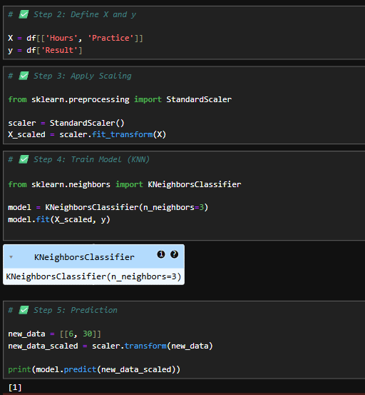

---

## Day 21 - 21 May 2026
### 🔹 Jupyter Notebook
[Open Notebook](2026-05-21_ML_021.ipynb)

### 🔹 Output Screenshot
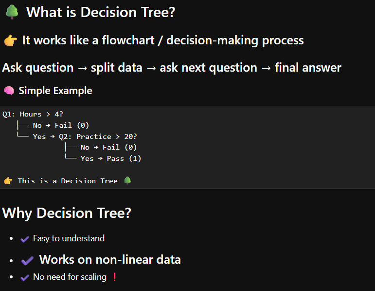

---

## Day 22 - 22 May 2026
### 🔹 Jupyter Notebook
[Open Notebook](2026-05-22_ML_022.ipynb)

### 🔹 Output Screenshot
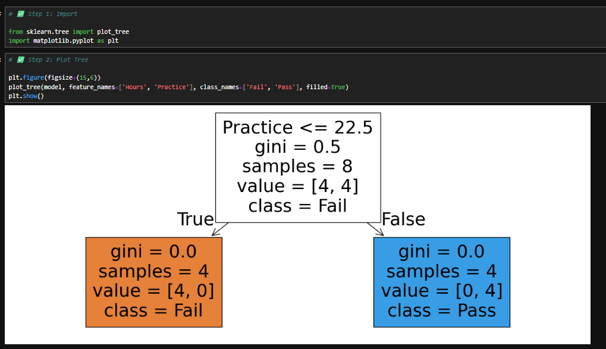

---

## Day 23 - 23 May 2026
### 🔹 Jupyter Notebook
[Open Notebook](2026-05-23_ML_023.ipynb)

### 🔹 Output Screenshot
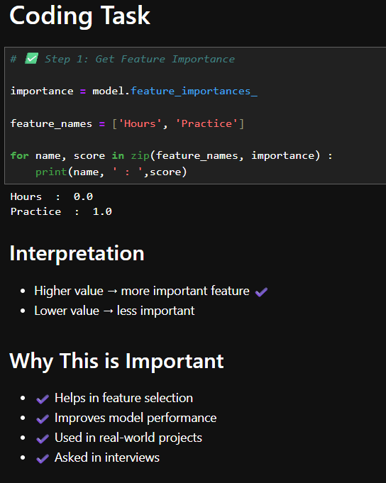

---

## Day 24 - 24 May 2026
### 🔹 Jupyter Notebook
[Open Notebook](2026-05-24_ML_024.ipynb)

### 🔹 Output Screenshot
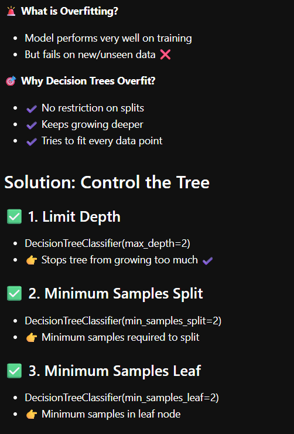

---

## Day 25 - 25 May 2026
### 🔹 Jupyter Notebook
[Open Notebook](2026-05-25_ML_025.ipynb)

### 🔹 Output Screenshot
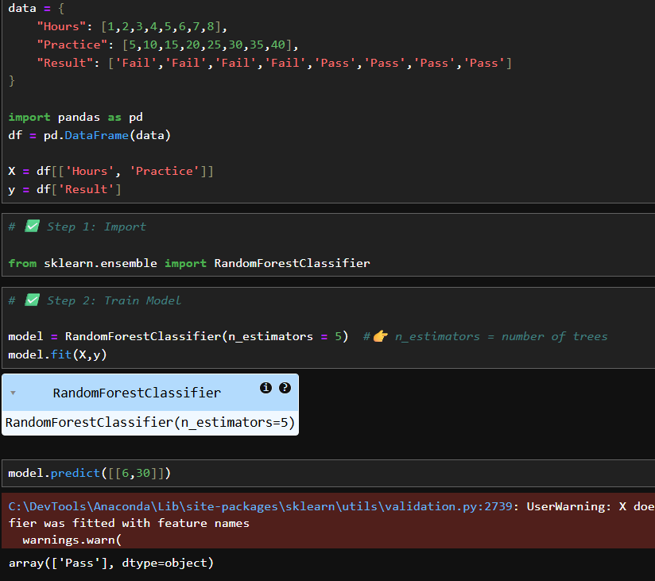

---

## Day 26 - 26 May 2026
### 🔹 Jupyter Notebook
[Open Notebook](2026-05-26_ML_026.ipynb)

### 🔹 Output Screenshot
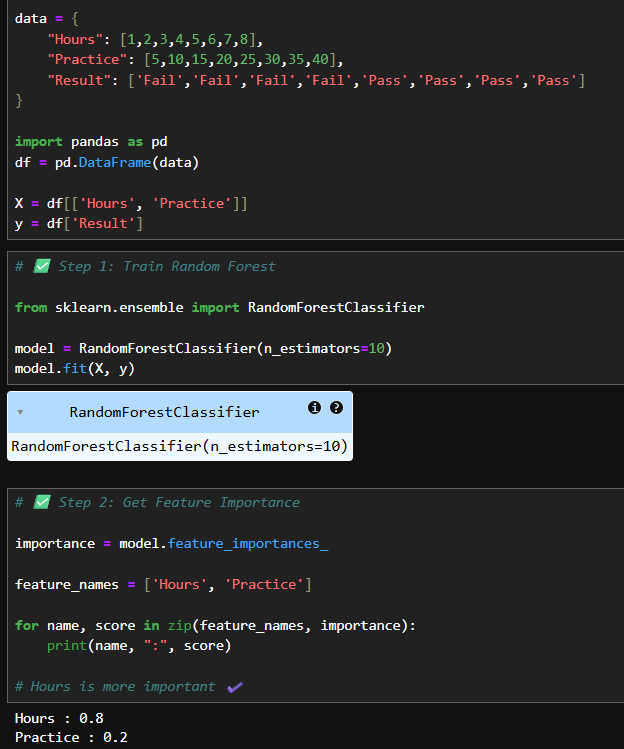

---

## Day 27 - 27 May 2026
### 🔹 Jupyter Notebook
[Open Notebook](2026-05-27_ML_027.ipynb)

### 🔹 Output Screenshot
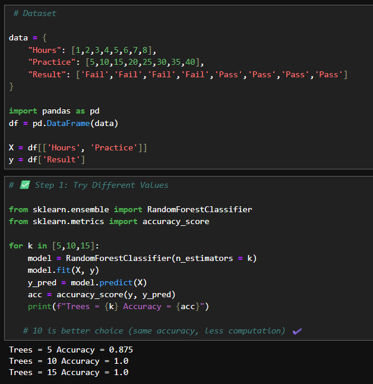

---

## Day 28 - 28 May 2026
### 🔹 Jupyter Notebook
[Open Notebook](2026-05-28_ML_028.ipynb)

### 🔹 Output Screenshot
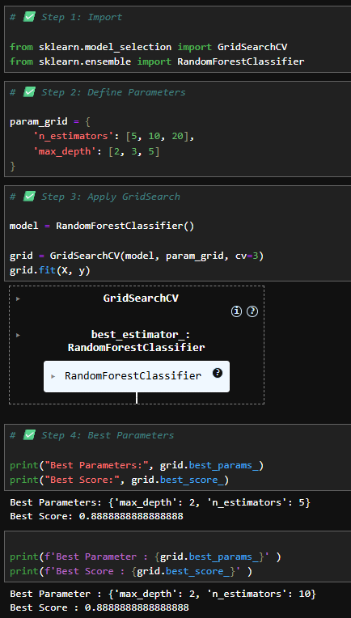

---

## Day 29 - 29 May 2026
### 🔹 Jupyter Notebook
[Open Notebook](2026-05-29_ML_029.ipynb)

### 🔹 Output Screenshot
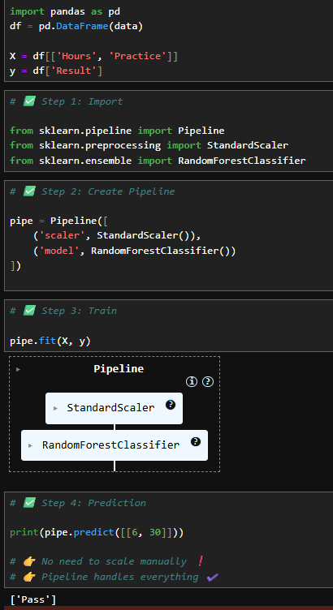

---

## Day 30 - 30 May 2026
### 🔹 Jupyter Notebook
[Open Notebook](2026-05-30_ML_030.ipynb)

### 🔹 Output Screenshot

---

## Day 31 - 31 May 2026
### 🔹 Jupyter Notebook
[Open Notebook](2026-05-31_ML_031.ipynb)

### 🔹 Output Screenshot
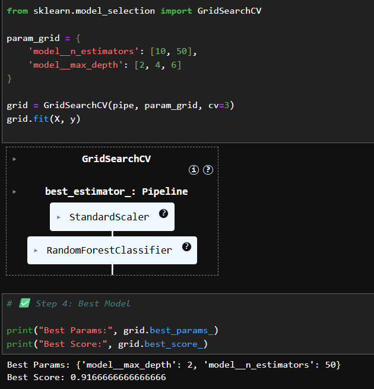

---

## Day 32 - 1 June 2026
### 🔹 Jupyter Notebook
[Open Notebook](2026-06-01_ML_032.ipynb)

### 🔹 Output Screenshot
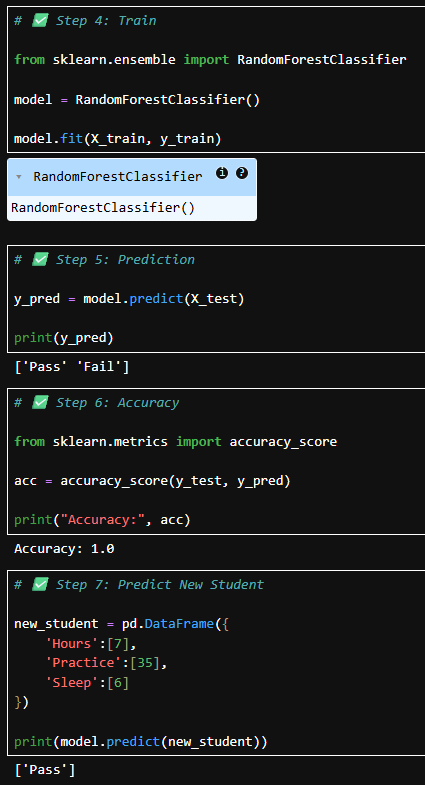

---

## Day 33 - 2 June 2026
### 🔹 Jupyter Notebook
[Open Notebook](2026-06-02_ML_033.ipynb)

### 🔹 Output Screenshot
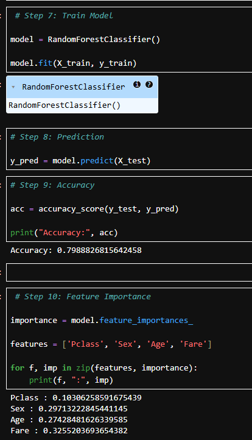

---

## Day 34 - 3 June 2026
### 🔹 Jupyter Notebook
[Open Notebook](2026-06-03_ML_034.ipynb)

### 🔹 Output Screenshot
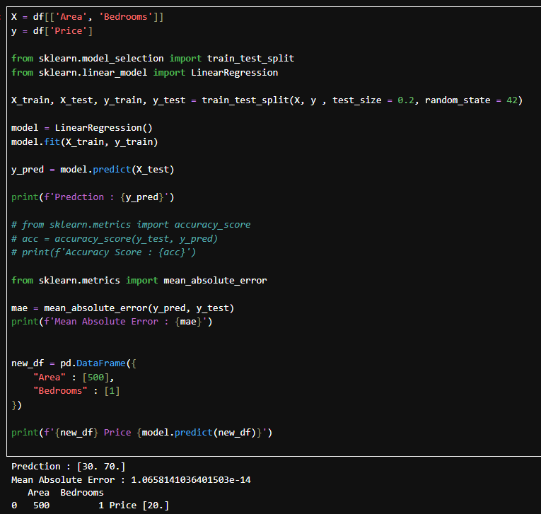

---

## Day 35 - 4 June 2026
### 🔹 Jupyter Notebook
[Open Notebook](2026-06-04_ML_035.ipynb)

### 🔹 Output Screenshot

---

## Day 36 - 5 June 2026
### 🔹 Jupyter Notebook
[Open Notebook](2026-06-05_ML_036.ipynb)

### 🔹 Output Screenshot

---

## Day 37 - 6 June 2026
### 🔹 Jupyter Notebook
[Open Notebook](2026-06-06_ML_037.ipynb)

### 🔹 Output Screenshot

---

## Day 38 - 7 June 2026
### 🔹 Jupyter Notebook
[Open Notebook](2026-06-07_ML_038.ipynb)

### 🔹 Output Screenshot

---

## Day 39 - 8 June 2026
### 🔹 Jupyter Notebook
[Open Notebook](2026-06-08_ML_039.ipynb)

### 🔹 Output Screenshot

---

## Day 40 - 9 June 2026
### 🔹 Jupyter Notebook
[Open Notebook](2026-06-09_ML_040.ipynb)

### 🔹 Output Screenshot

---

## Day 41 - 10 June 2026
### 🔹 Jupyter Notebook
[Open Notebook](2026-06-10_ML_041.ipynb)

### 🔹 Output Screenshot

---

## Day 42 - 11 June 2026
### 🔹 Jupyter Notebook
[Open Notebook](2026-06-11_ML_042.ipynb)

### 🔹 Output Screenshot

---

## Day 43 - 12 June 2026
### 🔹 Jupyter Notebook
[Open Notebook](2026-06-12_ML_043.ipynb)

### 🔹 Output Screenshot

---

## Day 44 - 13 June 2026
### 🔹 Jupyter Notebook
[Open Notebook](2026-06-13_ML_044.ipynb)

### 🔹 Output Screenshot

---

## Day 45 - 14 June 2026
### 🔹 Jupyter Notebook
[Open Notebook](2026-06-14_ML_045.ipynb)

### 🔹 Output Screenshot

---

## Day 46 - 15 June 2026
### 🔹 Jupyter Notebook
[Open Notebook](2026-06-15_ML_046.ipynb)

### 🔹 Output Screenshot

---

## Day 47 - 16 June 2026
### 🔹 Jupyter Notebook
[Open Notebook](2026-06-16_ML_047.ipynb)

### 🔹 Output Screenshot

---

## Day 48 - 17 June 2026
### 🔹 Jupyter Notebook
[Open Notebook](2026-06-17_ML_048.ipynb)

### 🔹 Output Screenshot

---

## Day 49 - 18 June 2026
### 🔹 Jupyter Notebook
[Open Notebook](2026-06-18_ML_049.ipynb)

### 🔹 Output Screenshot

---

## Day 50 - 19 June 2026
### 🔹 Jupyter Notebook
[Open Notebook](2026-06-19_ML_050.ipynb)

### 🔹 Output Screenshot

---

Continue the same pattern till:

## Day 100 - 8 August 2026
### 🔹 Jupyter Notebook
[Open Notebook](2026-08-08_ML_100.ipynb)

### 🔹 Output Screenshot

---

# 🛠️ Tools & Technologies Used

- Python
- NumPy
- Pandas
- Matplotlib
- Seaborn
- Scikit-learn
- Jupyter Notebook

---

# 🎯 Challenge Goals

- Build consistency in Machine Learning practice
- Improve problem-solving skills
- Create real-world ML mini projects
- Build a strong GitHub portfolio
- Prepare for Data Analyst & ML roles

---
